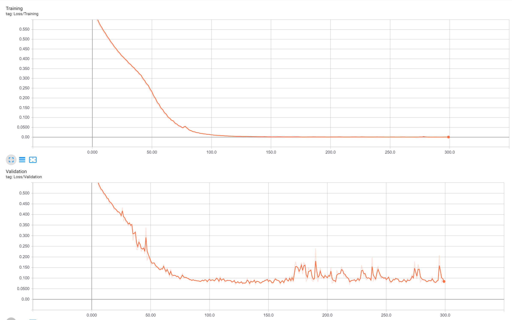

# Vertebrae and Spine Segmentation

This a simple UNET model to segment the spine images. The model is already trained. Make sure you have install `git lfs`. 

To launch the dashboard do the following (from the root directory):

1. Create a virtual emv:

```bash
$ python3 -m venv segmentation_env
```

2. Activate the virtual env (on windows platform activating is different)

```bash
$ source segmentation_env/bin/activate

```

3. Install dependencies
```bash
(segmentation_env)$ pip install requirements.txt
```

4. Run streamlit (from root of repository)

```bash
(segmentation_env)$ streamlit run serve_gui.py
```

To retrain the model do the following steps.


## Last modified by:

Hooman Sedghamiz, Jan 2022.


## Retraining from Scratch

**Dataset:** The “images” folder contains 20 pngs of spine MRI slices. The “masks” folder contains 20 .npy files, where each mask represents the segmentation map of the discs and vertebrae for the corresponding spine image (1.png goes with 1.npy, etc.). 

* Label 1: disc location
* Label 2: Vertebrae
* Label 0: Background


## What we’re looking for:
- [x] A data loader capable of reading in the provided dataset in batches
- [x] A script or instructions demonstrating using the data loader to run through 1 epoch of model training with a segmentation network
- [x] Well-organized, easily-understandable, and documented code
- [x] Object oriented programming where appropriate

### Additionally, please answer the following questions about your code:

* __What, if anything, did you do to verify that the segmentation masks and images were correctly aligned in the data loader?__
  * Checklist:
     * printing inbetween values to make sure the data is normalized well.
     * the values are in that specifice range or not.
     * the input shape is correct or not.
     * the lables changed to categorical format or not, since I use SoftMax for multi-class segmentation task.

* __What assumptions did you make about the data or model training during this process?__
  * Data augmentation, normalization, preprocessing and training procedures.

## Model output
In the following figure, you can see one test spine MR image that we randomly selected from the validation set to visually evaluate the quality of segmentation by the trained model.


## How to train the model:
Since the data were very few, I used an iterative data loader with online augmentation to cope with limited data and overfitting problems. During one epoch the data loader generates 100 augmented images/masks for training iteratively. 
_To train the model, please run the following command, you can change the parameters within the train.py file._

    python -u src\trainer.py -nc 3 -e 300
    
    ***You can update the following default training parameteres:***
    parser.add_argument("-unetlr", help="to set the learning rate for the unet", type=float, default=0.0001)
    parser.add_argument("-e", "--epochs", help="the number of epochs to train", type=int, default=300)
    parser.add_argument("-gn", "--gaussianNoise", help="whether to apply gaussian noise", action="store_true",
                        default=True)
    parser.add_argument("--n_samples", help="number of samples to train", type=int, default=100)
    parser.add_argument("-bs", "--batch_size", help="batch size of training", type=int, default=4)
    parser.add_argument("-nc", "--n_class", help="number of classes to segment", type=int, default=3)
    parser.add_argument("-nf", "--n_filter", help="number of initial filters for DR-UNET", type=int, default=32)
    parser.add_argument("-nb", "--n_block", help="number unet blocks", type=int, default=4)
    parser.add_argument("-pt", "--pretrained", help="whether to train from scratch or resume", action="store_true",
                        default=True)

## Tensorboard Log File



* Please place __weight files (.pth)__ inside the __weights/Verterbra_disk.unet_lr_0.0001_32.gaussian_noise/__ folder in order to reproduce the results and resume the training. 

* Otherewise you can change the _-pt_ parameter to __False__ to train the model from scratch. 

## How to test the model:
_To test the model please run the following command_

    python -u src\predict.py
The output will be something similar:

    Using TensorFlow backend.
    filters 32, n_block 4
    Verterbra_disk.unet_lr_0.0001_32.gaussian_noise
    (5, 3, 256, 256) (5, 3, 256, 256)
    The validation dice score: 0.913376534685773
    time elapsed for training (hh:mm:ss.ms) 0:00:04.292751
